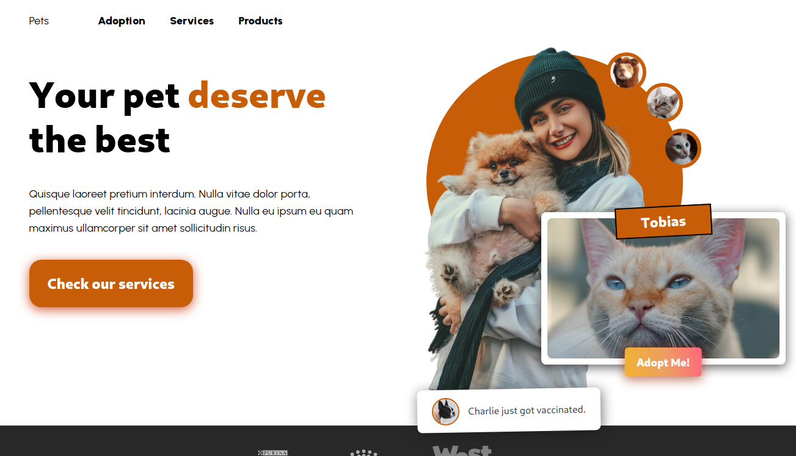

# Pets Frontend 🐕

Live: [https://diogotim-petshop.netlify.app/](https://diogotim-petshop.netlify.app/)

This project uses Nextjs and Typescript to create the frontend of a Petshop app.
There is a home page, a product listing page (including navigation), and individual product pages.

Initially, the app used the next/image component, but I changed it to next-optimized-images, that is why the client has some images that should have been served in the backend, as this way I do not need the backend live to create new builds into Netlify.

Ideally, more development would be needed to better accommodate different screen sizes, this is not production-ready.

## Installing
- Install [Node.js](https://nodejs.org/en/)
- Install yarn globally using `npm install --global yarn`
- Clone or download the project
- Run `yarn install` in the project folder

## Running
You can run the project using `yarn dev` or `yarn build` if you want to build it.
The local development app can be accessed at http://localhost:3000/

You will need to run the backend first.

## Tests

The tests use Jest and the React Testing Library, located in the \_\_tests\_\_ folder for the app pages, and in the individual components folders.

To run tests use `yarn test`